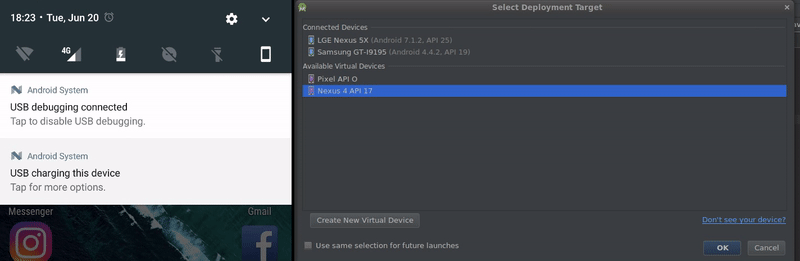

# ADB-Wifi
[](https://badge.fury.io/py/ADB-Wifi)  

A script to automatically connect android devices in debug mode using WIFI 
 
<p align="center">

</p>

## Motivation
Everyday I need to connect to a lot of diferent devices to my computer.  
Some devices have Micro-USB ports and others USB Type-C ports and I lose time plugging the devices and waiting for the ADB.  
So, I have created this script to auto connect a device using WIFI. 

**The diference to the other script and plugins:** The script save the connections in a configuration file to try reconnect when you boot your computer or when your device lost the wifi connection.

## Requirements
* Python 3
* ADB

## Installation

Using pip you can install ```adb-wifi```

### Linux and macOS:
```$ sudo pip install adb-wifi```

## Usage

1. Run ```$ adb-wifi```
You can add the ```adb-wifi``` to your startup applications.

2. Connect the devices to your computer and authorized the debub.

**Attention:** If your device turns off(battery, etc), you need to plug again the device to the computer because the adb need to open the ```tcpip port```!  
If your device has rooted you can use this [application](https://play.google.com/store/apps/details?id=com.ttxapps.wifiadb)
 to turn on the ```tcpip port```and ignore this step.

## Created & Maintained By
[Jorge Costa](https://github.com/extmkv)
